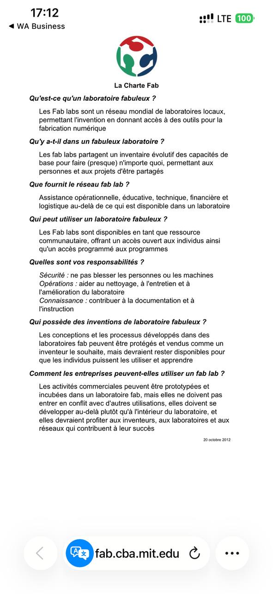

## JOURNAL DU 25 AOUT 2026: (rédigé par Cyrille AMEGANVI)

### Fait aujourd'hui
cette journée est débute par les revisions des acquis precedants puis suivie de sa continuté : 
- Comment faire un depot en ligne: 

Pour cela les liens sont envoyer par mail et on a  suivre les etapes suivants: 

-Ouvrir le dépot et cliquer sur *use this template*

-Choisir le compte de l'equipe comment propriétaire 

-Saisir le nom imposé, *pnfa2026-eqNN-non-court* 

-Laisser le depot en public 

-Créer le depot 

-Ajouter quelque collaborateur comme equipiers 

- Comment faire une initialisation 
- Comment faire un commit 
- On a ajoute le journale du jourS c'est a dire aujoud'hui  

---

**Presentation sur l'ecosystéme et raisau FABLABS** 

>cette présentation nous montre l'évolution de l'écosystéme du fablab, l'année de sa création jusqu'a nos jours. On note une évolution de 30 ans. Le premiers Fablas au togo à vu le jour en 2012 et se prénomait : *WoeLAB*. Les premiers problematique de ces fablas au togo était comment arrivé à crée les machines ou les matériels des fablabs eux-même sans dépendre de l'exterieur.....  

**Les dispositif attribué au fablabs**

*Fablabs* , *Makerspace* , Atelier* , 

**Les typologies des Fablabs** 
>- La charte des Fablabs: on peut le trouver a traver ce lien : [La chrate internationnalle des Fablabs](https://fab.cba.mit.edu/about/charter/)
>- Le résau des Fablabs : chaque Fablas doit être forcement dans un résau. Il est un résau constitué d'un résau mondial suivi d'un résau d'Afrique précisement ouest-Africain ensuite un résau national et enfin un résau local 

**Les inventaires de reference d'un Fablab**

>Ce sont les matéeriels principales qu'on trouve dans un lab : *découpe lasser* , *fraiseuse CNC* , *fraiseuse de précision* , *découpe vinyle* , * impression 3D* , *poste électronique* , 

les six 06 rubriques des fablabs 

- la charte internationnalle 

- le résau des fablabs 

### Appris 

>j'ai appris comment son fzite les résaux Fablabs, l'histoire des Fablabs du togo et leurs annéés d'existance qui est de 30ans et aussi le nom du premier Fablab est  *Woelab* j'ai appris que les problematiques des permiers lab au togo etais de repondre aux questons d'indépendance.

>j'ai appris qu'il existe une charte pour les Fablabs un peut comme un reglement dans les etabissements. 

>j'ai appris les matériels qu'on trouve dans un lab.  

### raté puis corrigé 

-j'ai pas toujours fait le depôt en ligne 

### Décidé 
 
>poursuivre les cours le lendemain , faire la documentation local et ensuite faire de dépôt aprés 

### A faire le lendemain 
pousuivre la documentation et faire son dépôt en ligne 