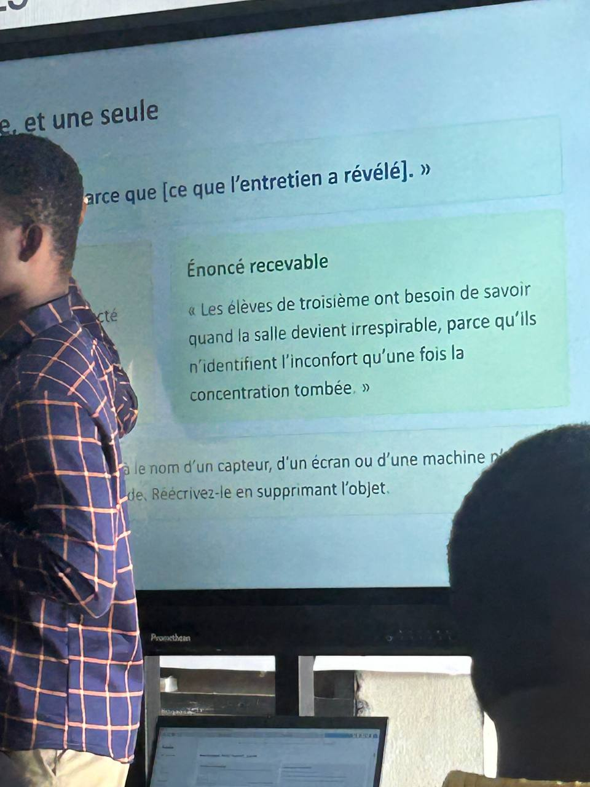
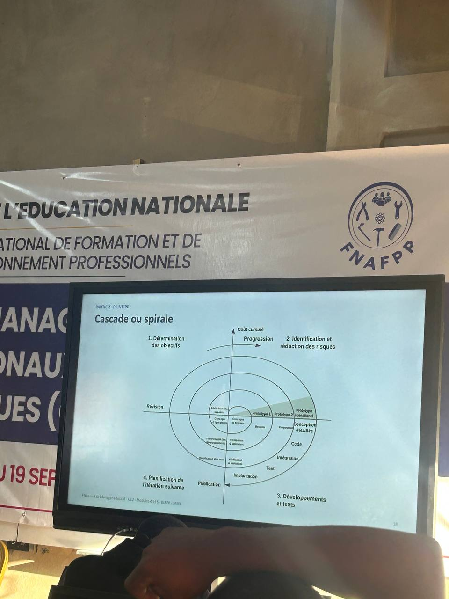

## JOURNAL DU 28 AOUT 2026

### FAIT AUJOURD'HUI

Section2 

- impression: 3D 
- on a copier un dossier pu on a parametre puis lancé l'impression ; 

En éléctronique 

j'ai appris à faire une programmation avec la cyberPi avec les LED et aussi on a fait une extention du cyberPi avec un light sensor 

En gestion des projets 

- Desing thinking c'est un projet qui est centré sur l'utilisateur.

-les étapes de thinking sont: *empathie, définir, idée , prototyper et tester* 

NB chaque étape n'est pas linaire on peut revenir à l'arrier à chaque fois 

1-Empathie: 

-[ ] Ce qu'il dit: c'est l'ecouter 
-[ ] ce qu'il fait: c'est Observer 
-[ ] ce qu'il pense: c'est une hypothese 
-[ ] ce qu'il ressent : 'c'est Hypothése 

2- Définir *usager à besoin de [besoin] parceque [ce que l'entretient à revelé]

Exemple 

3-Les Idées : c'est de partire de divergence-produit au convergence-trancher 

4- Protrotype: sans fabraquer 

-une question , une presentation 

-le senario d'usager 

-le croquis cote 

-la fabrication vient apres 

5-tester 

-conduire le processus avec les éléves: 

- méthode spirale ou cascade  

c'est un boucle à 4 étape illuster pae cette image 

- définir une version zéro jusqu'a la version final  
- le calendrier des boucles sur les jalons du programme 

### Appris 
-  jai appris comment parameter un ficher avant l'impression , le choix des filaments, comment trancher , comment faire aussi les suppenssions  et autre ...
- j'ai appris à faire une extension du cyberPi avec un light sensor 
- j'ai appris il existe deux types de méthodes de gestion de projet l'un est centré sur l'utilisateur répondre aux problemes de l'utulisateur l'autre est un méthode de projet plutôt en étape par étape comme son non l'indique le *spirale* cest de quitter une version V0 et arrivé au  projet final  

### raté puis corrige 
je pensais qu'on ne peut pas faire un projet sans finacement mais je me trompais 

dans les programation en ésslectronique je ne savais qu'il faut toujours une boucle sans fin que est le repeter toujours 
### Décidé 

- ne pas oublier le pour toujour en programation 
faire une recherche sur le logiciel  fusion 

### A faire demain 

- faire le choix du projet 
- poser des queston sur le dépôt en ligne 
- revoir le calendrier du jolons du projet 

