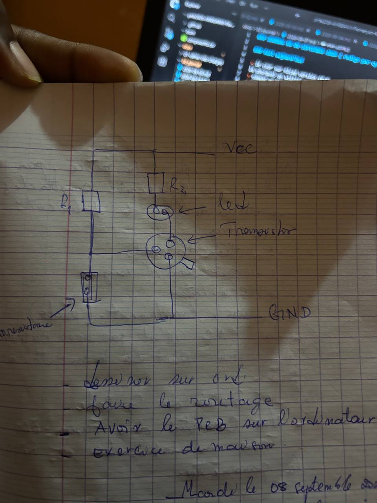

### JOURNAL DU 06 SEPTEMBRE 2026 ( redige par cyrille AMEGANVI )

### fait aujourd'hui 

- le cour sur Kicad version 10.0 
le pourquoi on utilise un PCB 
- coment un PCB : les differentes Etapes 
- commprender un PCB  c'est quoi un PCB  
- comment fabriquer un PCB  
- poirquoi passe du prototype au PCB 
- comment fait -on le cablage 
- passe de l'idée au schema d'un PCB 

### APPRIS

- le PCB est p;us accecssible plus que les autres 
- un pcb est un circuit imprimer qui comment plusieurs etapes 
- il existe plusieurs methode de fabriquation d'un PCB 
- l'anatomie d'un  PCB 
- comment passer de l'idée au schema du circuit imprimer 
- faire des exerccices 
- a dessiner dans mon cahier et ensuite le faire dans l'ordinateur
- faire le routage 
- faire l'enregistrement sur mon pc 

### RATE PUIS CORRIGE 
- le schema du circuit 

### decidee 
- 
### A FAIRE DEMAIN  
- 