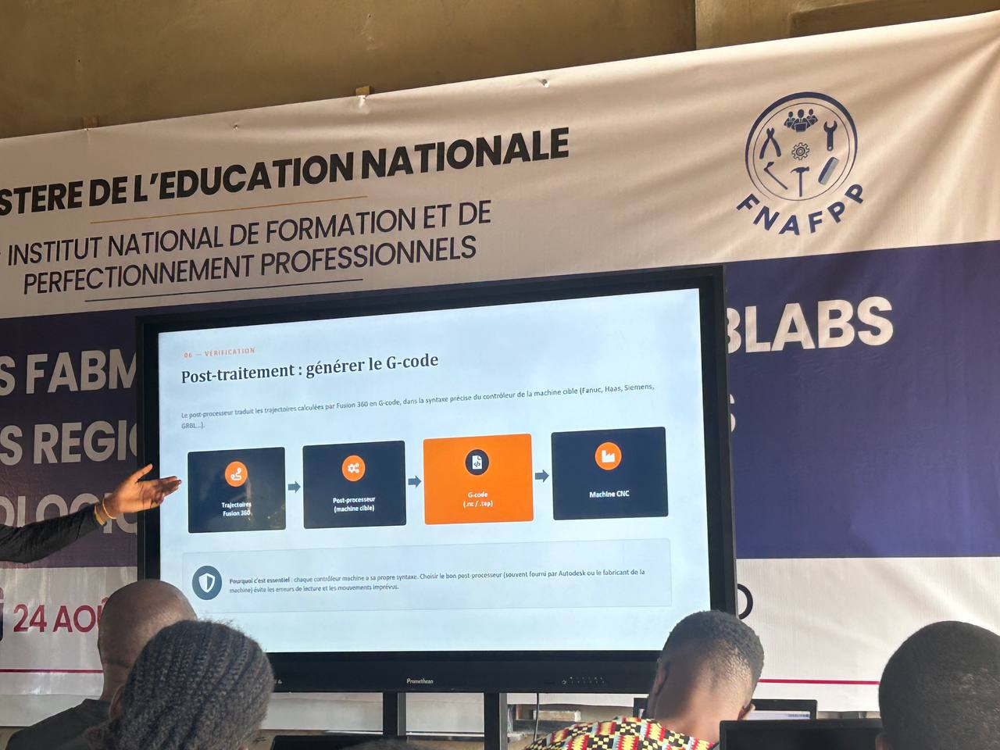

### JOURNAL DU 08 SEPTEMBRE 2026 (redige par cyrille AMEGANVI)

#### fait aujourd'hui 
- travaille du groupe 
- faire monter motre peojet sur une plaquette SK10 et passer a la programmation 
- le cour sur la FAO: cest une methode de fabriquation soustractive 
- les etapes de flux de fabrication : 

1 stup 2- choix d'outil 3- operation d'usinage 4- similation 5- post-traitement avec generation du G-code
1 stup 2- choix d'outil 3- operation d'usinage 4- similation 5- post-traitement avec generation du G-code 
 - la machine CNC et sa structure 
 - fait une conception dabs fision et parameter avec la machine CNC 

 #### appris 
 - comment faire le cablage de notre projet 
- comment faire une fabrication  dans fusion  et parameter avec la machine CNC 
### raté puis corrigé 

### decide 

### a faire demain 

